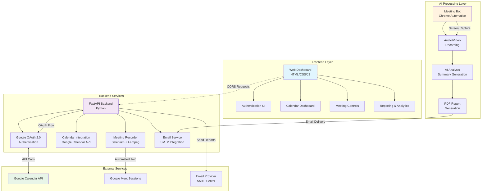

# AI Meeting Assistant

A comprehensive AI-powered meeting assistant that automatically joins Google Meet sessions, records meetings, generates intelligent summaries, and provides real-time insights through a professional web dashboard.

## Architecture Overview



## Features

### Core Functionality
- **Automated Meeting Participation**: Seamlessly joins Google Meet sessions using intelligent browser automation
- **Real-time Recording**: Captures high-quality audio and video with FFmpeg integration
- **AI-Powered Summaries**: Generates comprehensive meeting reports with key insights
- **Calendar Integration**: Full Google Calendar synchronization with OAuth 2.0 authentication
- **Professional Dashboard**: Clean, responsive web interface for meeting management

### Advanced Capabilities
- **Live Meeting Monitoring**: Real-time participant tracking and meeting status updates
- **Intelligent Reporting**: Detailed analytics on meeting patterns and productivity metrics
- **Automated Email Reports**: PDF summary distribution to meeting participants
- **Multi-session Management**: Concurrent meeting handling with session tracking
- **Cross-platform Support**: Compatible with Linux, macOS, and Windows environments

## Technology Stack

### Frontend
- **Languages**: HTML5, CSS3, JavaScript (ES6+)
- **Framework**: Vanilla JavaScript with modern DOM APIs
- **Styling**: Custom CSS with CSS Grid and Flexbox
- **Authentication**: OAuth 2.0 flow integration

### Backend
- **Framework**: FastAPI (Python 3.8+)
- **Authentication**: Google OAuth 2.0 with secure token management
- **APIs**: Google Calendar API v3 integration
- **Database**: File-based session storage with JSON metadata
- **Email**: SMTP integration for automated report delivery

### Automation & Recording
- **Browser Automation**: Selenium WebDriver with Chrome
- **Video Recording**: FFmpeg with optimized encoding settings
- **Audio Processing**: Multi-source audio capture (system + microphone)
- **Driver Management**: Automatic ChromeDriver version matching

## Prerequisites

### System Requirements
- Python 3.8 or higher
- Google Chrome or Chromium browser
- FFmpeg installation
- Active internet connection
- Valid Google account with Calendar access

### Development Dependencies
```bash
# Core Python packages
fastapi>=0.104.1
uvicorn[standard]>=0.24.0
selenium>=4.0.0
webdriver-manager>=3.8.0

# Google API integration
google-auth>=2.23.4
google-auth-oauthlib>=1.1.0
google-api-python-client>=2.108.0

# Additional utilities
pydantic>=2.5.0
python-multipart>=0.0.6
```

## Installation & Setup

### 1. Clone Repository
```bash
git clone git@github.com:humza-zahid/AI-Meeting-Assistant.git
cd ai-meeting-assistant
```

### 2. Install Dependencies
```bash
pip install -r requirements.txt
```

### 3. Google Calendar API Setup
1. Visit [Google Cloud Console](https://console.cloud.google.com/)
2. Create new project or select existing one
3. Enable Google Calendar API
4. Create OAuth 2.0 credentials
5. Download `credentials.json` to project root
6. Add authorized redirect URIs:
   - `http://localhost:8000/auth/callback`
   - `http://localhost:8080/oauth-callback.html`

### 4. Environment Configuration
Create `.env` file in project root:
```bash
# Email Configuration (Optional)
EMAIL_SENDER=your-email@gmail.com
EMAIL_PASSWORD=your-app-password
EMAIL_RECIPIENT=recipient@gmail.com
SMTP_SERVER=smtp.gmail.com
SMTP_PORT=465

# Recording Configuration
MEET_RECORDINGS_ROOT=./recordings
SUMMARY_DELAY_SECONDS=300

# Chrome Configuration (Optional)
CHROMEDRIVER_PATH=/path/to/chromedriver
```

### 5. System Dependencies

#### Ubuntu/Debian:
```bash
sudo apt update
sudo apt install python3-pip chromium-browser chromium-chromedriver ffmpeg
```

#### macOS:
```bash
brew install python3 chromium ffmpeg
```

#### Windows:
1. Install Python 3.8+
2. Download Chrome browser
3. Install FFmpeg and add to PATH

## Usage Guide

### 1. Start the Application
```bash
# Terminal 1: Start backend server
python backend.py

# Terminal 2: Start frontend server
python frontend_server.py
```

### 2. Authentication Flow
1. Navigate to `http://localhost:8080`
2. Click "Continue with Google Calendar"
3. Complete OAuth authorization
4. Grant calendar access permissions

### 3. Meeting Management
- **View Dashboard**: Monitor upcoming and active meetings
- **Join & Record**: Automatically join meetings with AI assistant
- **Generate Reports**: Receive AI-powered meeting summaries
- **Track Analytics**: Access detailed meeting insights

## API Documentation

### Authentication Endpoints
- `GET /auth/status` - Check authentication status
- `POST /auth/connect` - Initialize OAuth flow
- `GET /auth/callback` - Handle OAuth callback
- `POST /auth/logout` - Terminate session

### Calendar Operations
- `GET /calendar/events?days=7` - Fetch calendar events
- `POST /join-and-record` - Start meeting recording
- `POST /stop-recording` - End recording session
- `GET /active-sessions` - List active recordings

### Reporting Features
- `POST /summary/email` - Send meeting summary
- `GET /participant-count/{session_id}` - Get participant stats

## Configuration Options

### Recording Settings
```python
# Modify in recorder.py
FPS = 25  # Video frame rate
AUDIO_BITRATE = "192k"  # Audio quality
VIDEO_PRESET = "veryfast"  # Encoding speed vs quality
```

### Meeting Bot Behavior
```python
# Customize in backend.py
HEADLESS_MODE = False  # Visible browser window
AUTO_MUTE = True  # Disable microphone on join
AUTO_CAMERA_OFF = True  # Disable camera on join
JOIN_TIMEOUT = 30  # Seconds to wait for join
```

## Project Structure

```
ai-meeting-assistant/
├── backend.py              # Main FastAPI application
├── frontend_server.py      # Static file server
├── recorder.py             # FFmpeg recording utility
├── credentials.json        # Google API credentials
├── requirements.txt        # Python dependencies
├── auth.html              # Authentication interface
├── dashboard.html         # Main dashboard
├── summary.html          # Meeting summaries
├── styles.css            # Application styling
├── app.js               # Frontend JavaScript
├── recordings/          # Meeting recordings
└── .env                # Environment variables
```

## Deployment Considerations

### Production Setup
- Use HTTPS with SSL certificates
- Configure reverse proxy (nginx/Apache)
- Set up process management (systemd/supervisord)
- Implement proper logging and monitoring
- Secure credential storage

### Security Best Practices
- Rotate Google API credentials regularly
- Use environment variables for sensitive data
- Implement rate limiting on API endpoints
- Validate and sanitize all user inputs
- Regular security audits and updates

## Troubleshooting

### Common Issues

**ChromeDriver Version Mismatch**
```bash
# Solution: Update Chrome and ChromeDriver
export CHROMEDRIVER_PATH=/path/to/compatible/chromedriver
```

**Google Meet Join Failures**
- Verify meeting URL format
- Check microphone/camera permissions
- Ensure stable internet connection
- Review browser console for errors

**FFmpeg Recording Issues**
- Confirm FFmpeg installation: `ffmpeg -version`
- Check audio device availability
- Verify disk space for recordings
- Review system audio permissions

### Debug Mode
Enable verbose logging:
```bash
export LOG_LEVEL=DEBUG
python backend.py
```

## Contributing

### Development Workflow
1. Fork repository
2. Create feature branch
3. Implement changes with tests
4. Submit pull request with detailed description

### Code Standards
- Follow PEP 8 for Python code
- Use semantic commit messages
- Add docstrings for public functions
- Maintain test coverage above 80%

## License

This project is licensed under the MIT License. See LICENSE file for details.

## Support

For technical support and feature requests:
- Create GitHub issue with detailed description
- Include system information and error logs
- Provide steps to reproduce issues

---
